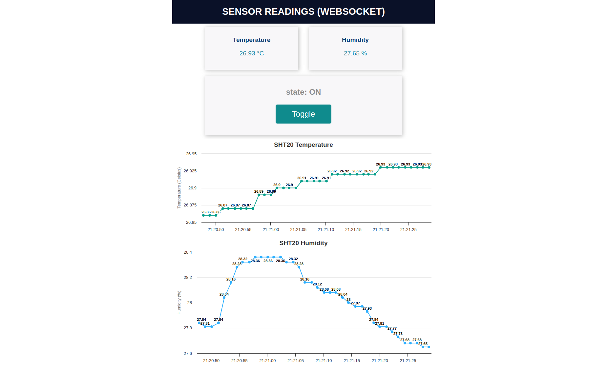

# NodeMCU SHT20 Sensor Data WebSocket Server

This repository contains code for programming a NodeMCU to read data from an SHT20 sensor (humidity and temperature) and send it through a WebSocket server. Users can connect to the NodeMCU via its IP address (within the same network) to view a chart of sensor data. Additionally, users can toggle an LED on the web page, all facilitated through WebSocket communication. The web pages are created using HTML, CSS, and JavaScript. These resources are uploaded to the flash memory of the NodeMCU. For uploading these files, I am using the LittleFS file system uploader.

## Features

- **Sensor Data Reading**: Utilizes the SHT20 sensor to accurately measure humidity and temperature.
- **WebSocket Server**: Establishes a WebSocket server on the NodeMCU for real-time communication with connected clients.
- **Web Interface**: Provides a web page where users can visualize sensor data in the form of a chart and toggle an LED.
- **Chart Display**: Displays sensor data using HTML, CSS, and JavaScript for a user-friendly graphical representation.
- **LED Control**: Allows users to remotely control a LED connected to the NodeMCU through the web interface.
- **Web Page Creation**: The web pages are created using HTML, CSS, and JavaScript. These resources are uploaded to the flash memory of the NodeMCU. For uploading these files, the LittleFS file system uploader is used.

## Additional Resources

For more detailed information and tutorials, refer to the following resources:

- [Tutorial on Filesystem Uploader in Arduino](https://randomnerdtutorials.com/install-esp8266-filesystem-uploader-arduino-ide/): Learn how to use the Filesystem Uploader in Arduino IDE to upload files to the SPIFFS file system on ESP8266-based boards like NodeMCU.

- [Tutorial on Making Charts using HTML, CSS, and JavaScript](https://randomnerdtutorials.com/esp32-esp8266-plot-chart-web-server/): This tutorial demonstrates how to create charts using HTML, CSS, and JavaScript for displaying sensor data on a web server hosted by an ESP32 or ESP8266 microcontroller.

- [WebSocket Tutorial for Reading Sensor Data](https://randomnerdtutorials.com/esp8266-nodemcu-websocket-server-sensor/): Check out this tutorial to learn how to use WebSocket to read sensor data from an ESP8266 (NodeMCU) and display it in real-time on a web page.

- [YouTube Tutorial on Reading Data from an SHT20](https://www.youtube.com/watch?v=39tdEvN_jak): Check out this helpful video tutorial demonstrating how to read data from an SHT20 sensor using NodeMCU. The tutorial covers both hardware setup and software implementation.

- ## Example

